# **Login e configurações iniciais**

Em primeiro lugar, você precisa acessar a área administrativa do seu site, para isso você deve digitar o endereço:

http://nomedoseusite.com.br/wp-admin

Esse endereço será fornecido quando você receber o acesso para a área administrativa do seu site. Uma página como essa será exibida ao acessar o endereço:

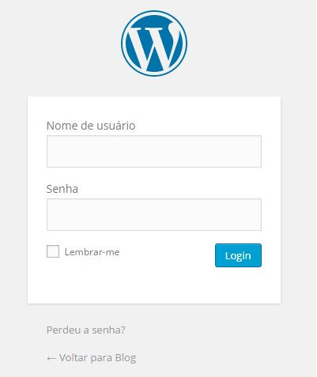

Digite o nome de usuário e senha, e depois clique no botão Login.

Ao realizar o login, você estará dentro da página administrativa do seu site, a página irá parecer da seguinte forma:

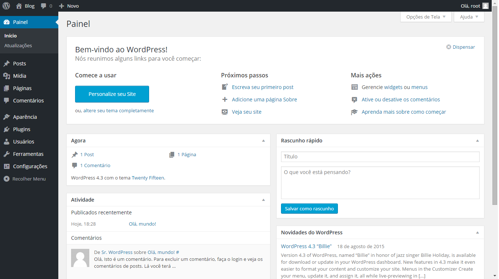

### Configurações iniciais após a instalação do WordPress

Após a instalação do WordPress ele é apenas uma instalação simples com posts, temas, comentários e páginas demonstrativas, porém ainda existem muitas coisas que podemos fazer para deixar o site/blog mais atrativo para o público.

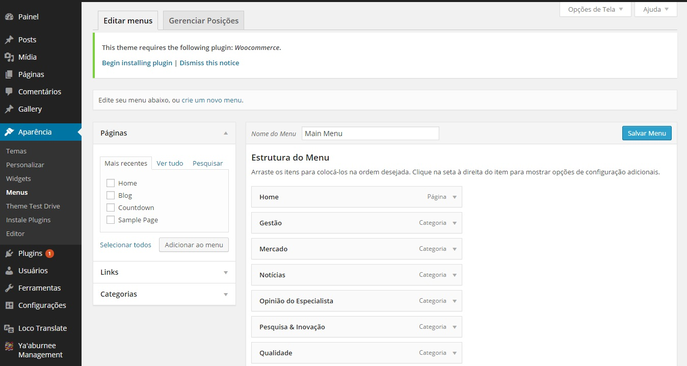

#### Alterar o título e Descrição

Para alterar o título e a descrição do seu site/blog vá  **Configurações > Geral**.

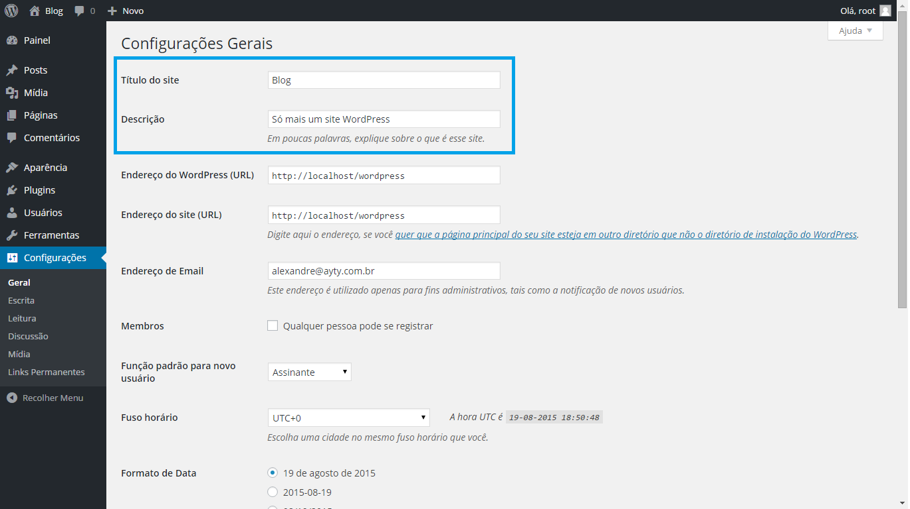

Modifique também as configurações de Membros, Função para novos usuários e o Fuso  horário.

### Membros

Para sites em WordPress que serão Blogs é recomendado desmarcar a opção de Membros uma vez que não há a necessidade dos usuários se registrarem no seu blog, porém se o site precisa que os usuários se registrem então marque esta opção para permitir o registro de usuários no seu site.

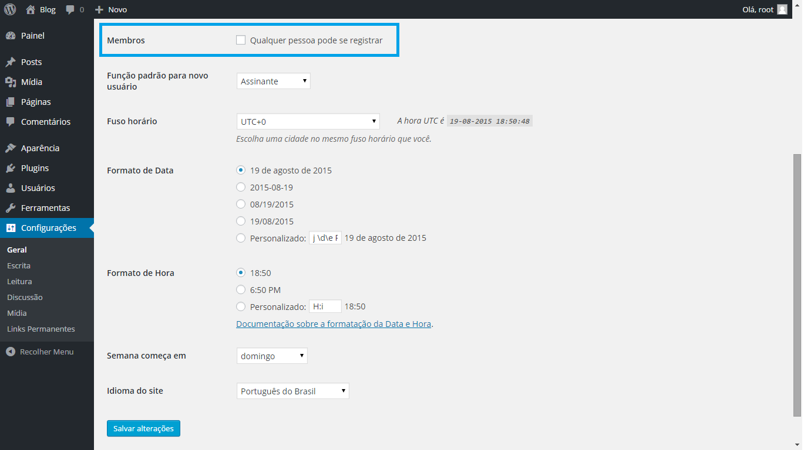

### Função Novos Usuários

Se você decidiu que seu site é do tipo que precisa do registro de usuários pode definir aqui qual "Função" deve ser aplicada a ele quando se registrar em seu site.

### Fuso Horário

Alterar o Fuso horário é importante para garantir que seus posts/artigos entre outras funções estejam de acordo  com o fuso horário de seus visitantes e o seu também, o fuso horário do Brasil é o **UTC-3**.

### Formato de Data e Hora

O formato de data e hora deve ser alterado para que os visitantes visualizem da melhor forma, a data/hora em que seus artigos foram publicados.

### Links Permanentes

Por padrão o WordPress cria para cada postagem do seu blog uma URL usando caracteres que não dizem nada sobre o conteúdo das páginas, ele usa por padrão o link http://www.nome_do_blog.com/?p=123.

Esse modo de exibir as URL's não facilita em nada para os visitantes e não informa nada para os mecanismos de busca.

Para modificar a estrutura dos links permanentes já no Painel do WordPress vá em **Configurações > Links Permanentes**.

Na página a seguir será exibido diversas possibilidades de padrões de configuração dos links, temos as opções comuns e para os usuários mais avançados temos a opção de Estrutura Personalizada.

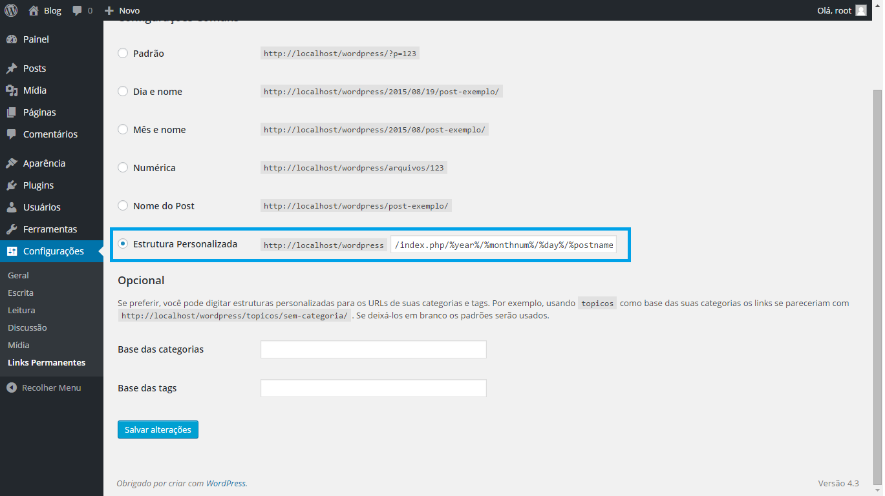

Também é possível alterar a estrutura do link permanente na área de criação dos posts como mostra a imagem abaixo:

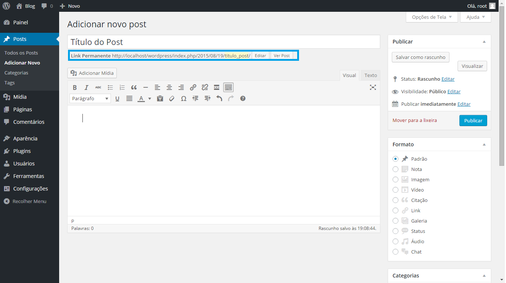

### Editando seu perfil

Para ver os seus dados de login, passe o mouse sobre a palavra Usuário, assim que o menu Perfil aparecer, clique nele. Nesta página você pode editar qualquer dado de acesso referente a seu perfil, incluindo senha.

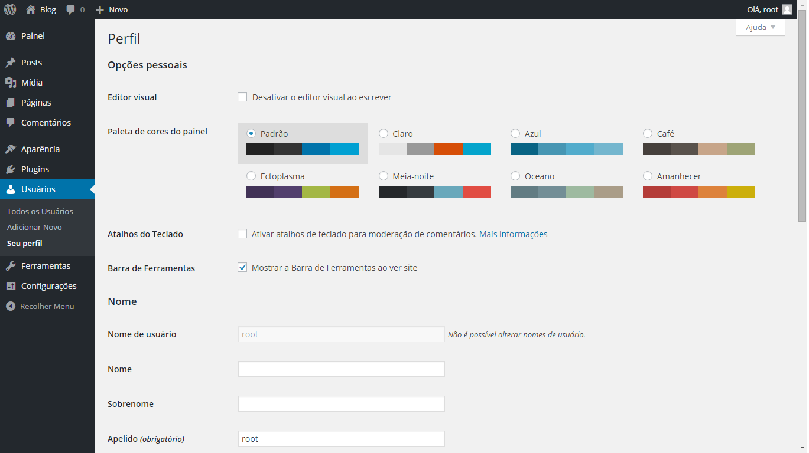

Não se esqueça de clicar no botão **Atualizar Perfil** para validar as mudanças. Caso isto não seja feito, as alterações não serão consideradas.

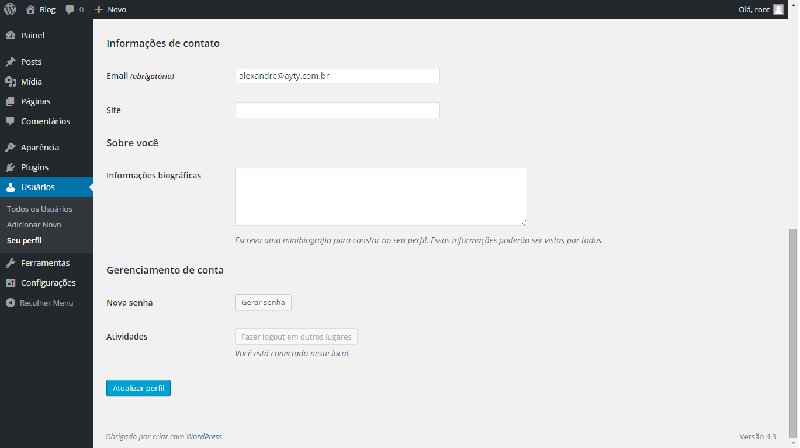

### Adicionando novos usuários

Você também pode adicionar outros usuários para gerenciar o conteúdo de seu site. Para adicionar novos usuários, vá até a guia Usuário no menu, e clique em Adicionar Novo.

A página será exibida como abaixo. Caso necessário, você pode selecionar a caixa Enviar Senha para enviar a senha para o e-mail do novo usuário.

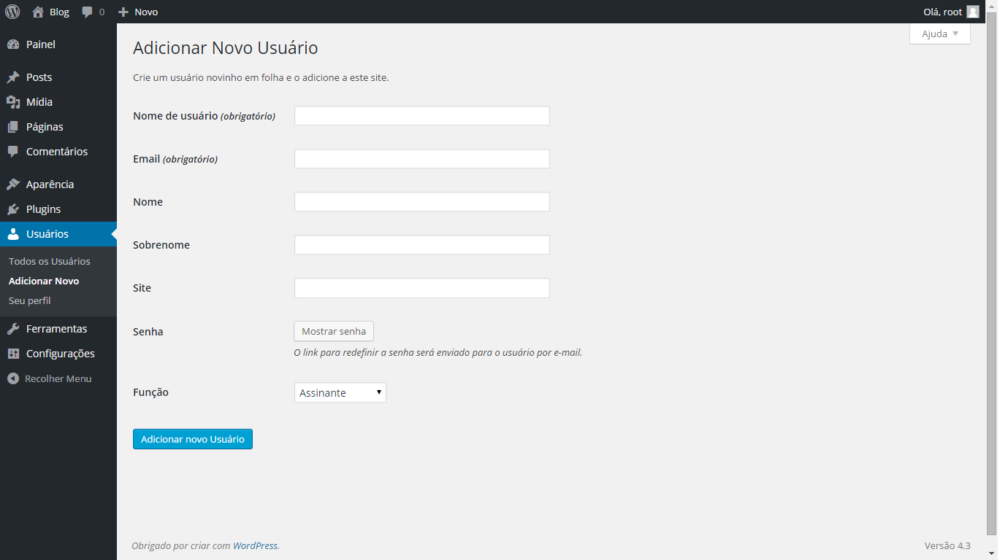

Todos os usuários serão exibidos na aba Usuários - Todos os Usuários, para editar os dados de cadastro de um usuário, basta mover o mouse sobre o nome de usuário e clicar em Editar. Não se esqueça de aplicar as alterações antes de fechar a página.

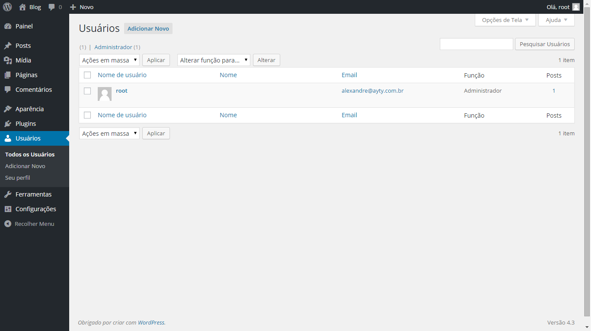

