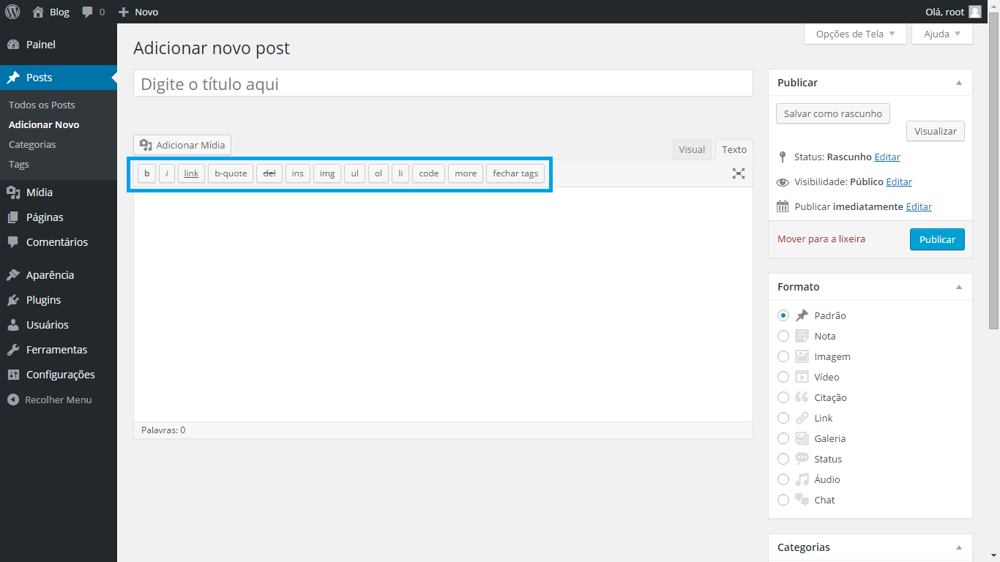
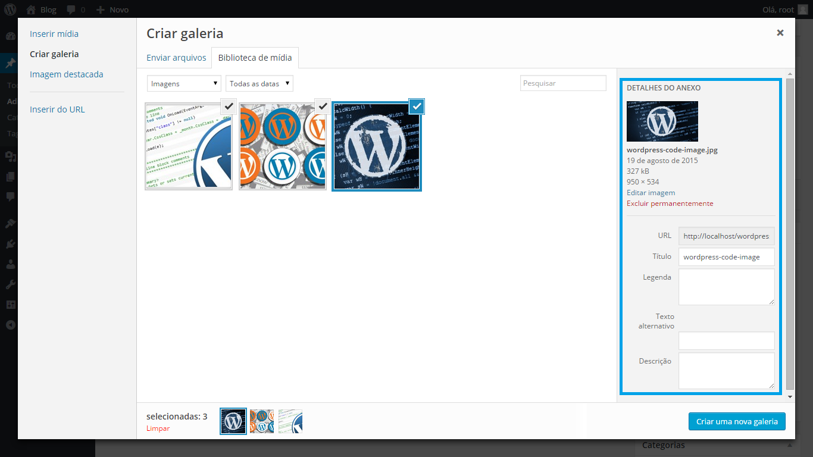

# Gerando Conteúdo

Agora vamos ver como você pode alterar o conteúdo das páginas do seu site. Existem dois formatos para as páginas do seu site, uma é o Post e a outra é a Página. Os posts são usados para as páginas que se enquadram nas categorias dentro do seu site.

As páginas são usadas são usadas para páginas fixas, que não possuem uma Categoria.

### Criando posts

Para criar um novo Post, clique na aba **Post** no menu, em seguida clique em **Adicionar Novo**. A página de novo Post será exibida, você vai encontrar diferentes campos para inserir o conteúdo de seu novo Post.

O primeiro campo é o título do Post. Este título é o título de sua página como ela aparecerá em seu site. O link de acesso (permalink) também será gerado a partir deste título.

Se você tem um site em vários idiomas, você encontrará um campo para cada idioma, no entanto, a ligação será única no idioma que adotou como o idioma padrão. Nos campos abaixo, você pode inserir o conteúdo da sua página, os textos, imagens, vídeos, etc.

Além da edição de página visual, também temos a edição de texto, onde você pode inserir códigos html.

### Adicionando fotos

Se você quiser adicionar fotos a sua página, basta clicar em Adicionar Mídia, logo acima da caixa de texto principal.

Uma janela como a janela abaixo será aberta, você deve clicar em Selecionar arquivos, assim você pode inserir as imagens que quiser localizando-as em seu computador.

Em seguida, na janela que será exibida você pode editar o título da sua imagem, o link, a descrição, legenda e texto alternativo (será exibido quando você parar o mouse em cima da imagem). Para inserir várias imagens de uma vez, selecione-as e clique em inserir no post.

Se você deseja excluir a imagem, basta clicar em **Excluir Permanentemente**.

Quando seu Post estiver pronto, você pode visualizá-lo clicando no botão **Visualizar**, uma nova janela aparecerá mostrando o conteúdo do seu post.

Se você deseja excluir a imagem, basta clicar em **Excluir Permanentemente**.

Quando seu Post estiver pronto, você pode visualizá-lo clicando no botão Visualizar, uma nova janela aparecerá mostrando o conteúdo do seu post.

### Imagem destacada (thumbnails)

Se o seu post é exibido com imagens de thumbnails (imagens pequenas) em seu site, na área de edição, clique no campo Configurar imagem destacada, ao clicar, você pode escolher uma nova imagem, ou escolher uma imagem que já se encontra em sua galeria.

Antes de publicar, você deve escolher uma categoria na sessão Categorias, se ela não existir, você pode criá-la clicando sobre Adicionar nova categoria.

### Galeria de fotos

Uma galeria de fotos deve ser adicionada ao site/blog quando há a necessidade de adicionar uma quantidade grande de imagens em um post ou uma página do site, com uma galeria as imagens ficam mais organizadas e facilita na visualização para os visitantes.

O WordPress possui uma forma de adicionar galeria de imagens nativa na plataforma, a primeira coisa que precisamos fazer é editar ou criar a página onde deve ser adicionada a galeria, depois clique no botão Adicionar Mídia que está localizado na parte superior da área de texto, esse é o mesmo processo para se adicionar uma foto apenas.

Para criar sua galeria é possível colocar fotos novas que estão no computador (aba Enviar Arquivos) ou utilizar as fotos que já estão disponíveis no site/blog (aba Biblioteca de Mídia).

Escolha todas as fotos a serem inseridas na galeria e clique no botão Criar Galeria, em seguida deve-se configurar o comportamento da galeria de fotos, podemos escolher a ordem das fotos, para isso basta arrastá-las, pode-se escolher o número de colunas que a galeria irá ter e também adicionar um link para as fotos.

