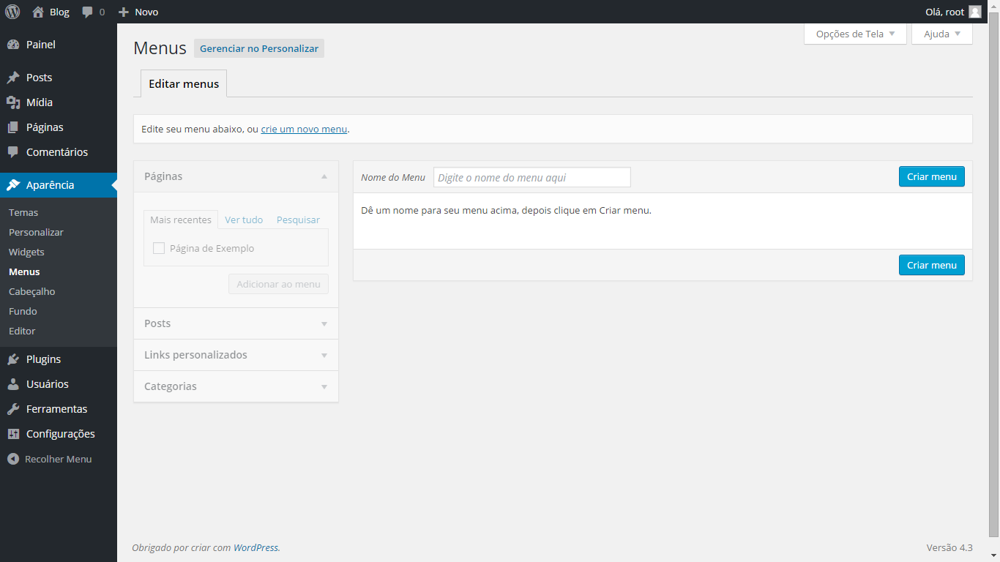

# Configurações

É possível também adicionar um vídeo apenas colando a URL retirada do navegador como por exemplo:

https://www.youtube.com/watch?v=bPIGwHeErwc

A lista completa de serviços online suportados pelo WordPress utilizando essa funcionalidade pode ser vista no link:

http://codex.wordpress.org/embeds

### Gerenciar categorias

Seus Posts serão exibidos na aba Posts - Todos os Posts. Nesta página você vai encontrar todos os posts publicados, você poderá editá-lo, basta passar o mouse sobre o nome do post e clicar em editar. Caso queira apagar o post, clique em **Lixeira**.

Para apagar permanentemente, basta ir na guia Lixo, e clicar em **Excluir Permanentemente**, caso queira restaurar o post, clique em Restaurar.

### Criar/editar categorias

Para editar as categorias que você criou basta ir a aba **Post > Categorias**, lá você pode editar todas as configurações das categorias e criar novas.Para criar páginas fixas, na aba **Páginas**, clique em **Adicionar Nova**. O procedimento é semelhante ao de Post com a exceção de que páginas fixas não pertencem a categorias.

Não se esqueça de confirmar as alterações clicando em **Aplicar** antes de fechar a página.

### Excluir categorias

Você pode apagá-las selecionando as categorias que você deseja excluir, e em seguida clicar na lista **Ações em Massa** e escolha **Excluir**, depois pressione aplicar.

### Adicionando categorias aos menus

Para acessar os menus, vá até a aba **Aparência > Menus**, onde você vai encontrar diferentes menus para mostrar no seu site.

Selecione o menu que deseja editar e em seguida no canto inferior esquerdo, você dele selecionar as páginas que você pretende adicionar, em seguida, clique em **Adicionar** ao menu que será exibido na caixa a direita.

### Alterar a ordem dos itens no menu

Para mudar a ordem dos itens no menu de navegação, basta um arrastar/soltar no item desejado, não se esquecendo de clicar em Salvar menu.

### Excluir itens do menu

Se você quiser excluir um item do menu, clique no nome do item desejado e uma caixa aparecerá abaixo, clique no link Remover e em seguida clique em Salvar Menu, para salvar a alteração.

### Adicionando links ao menu

Você também pode adicionar links ao menu de navegação, para isto você deve ir a área de Links ao lado esquerdo, e digitar o endereço do link sobre o campo URL e no campo do Texto do link você deve inserir o título. Não se esqueça de clicar em **Adicionar ao Menu** e depois em **Salvar Menu** para salvar as alterações.

### Gerenciar fotos e comentários

Você pode gerenciar sua galeria de imagens, indo para o menu **Mídia > Biblioteca**. Uma lista das suas imagens irá aparecer, o procedimento para apagar e editá-las é o mesmo que para os posts.

Ao clicar em editar, você pode inserir textos e legendas para estas imagens, para que seja melhor classificada no Google Imagens.

Se o site tem a função de comentários, estes podem ser gerenciados no menu Comentários.

Editar as configurações principais

* **Alterar o título do site**

Se você deseja alterar as configurações do seu site, vá para a guia Configurações > Geral, onde você pode alterar o Título do seu site.

* **Alterar a página inicial**

Para alterar a página inicial do seu site, vá para a aba Leitura dentro de Configurações, sobre o campo Página Inicial escolha uma das páginas que já foram publicadas no seu site como página inicial.

