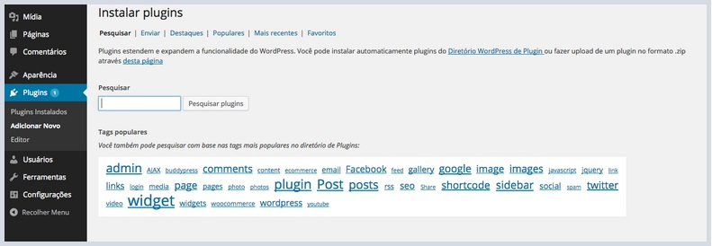
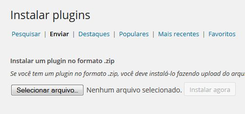
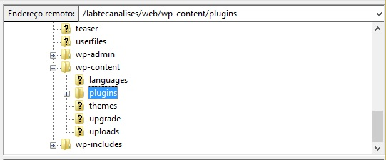
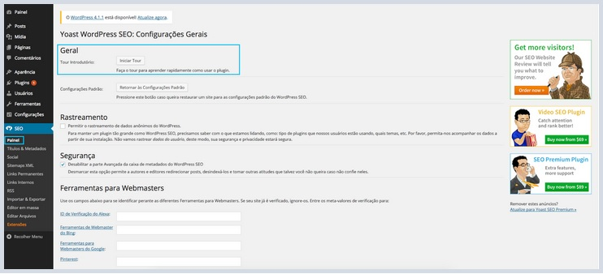
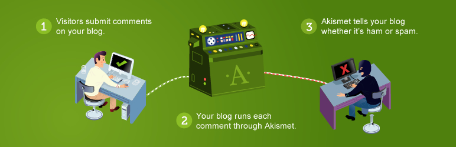
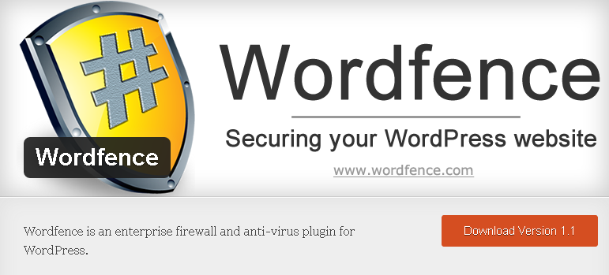

# Plugins

### Funções, Plugins

O que é:

Plugins são ferramentas para estender a funcionalidade do WordPress. O núcleo do WordPress é projetado para ser leve, para maximizar a flexibilidade e minimizar o inchaço de código. Plugins oferecem funções personalizadas e funcionalidades para que cada usuário consiga personalizar seu site segundo suas necessidades específicas.

* Adicionando novos Plugins

Para adicionar novos Plugins, vá até a aba **Plugins > Adicionar Novo**.

Na barra de pesquisa, você pode pesquisar por diversos Plugins para adicionar ao seu site, para ativá-los, basta clicar na opção "Instalar" do plug-in desejado, e depois ativá-lo na tela principal de Plugins clicando em Ativar plug-in.

### Instalando um plugin utilizando o método upload do WordPress

O método de upload do WordPress serve para os casos em que é necessário fazer o upload de um plugin pago ou que se encontra no site de algum autor.

O primeiro passo é fazer o download do plugin diretamente do site (geralmente é um arquivo com a extensão .zip), em seguida acesse o painel de controle, clique em **Plugins > Adicionar Novo**, então clique na tab **Enviar**.

Clique no botão **Selecionar Arquivo** e procure o plugin no formato .zip que foi baixado, em se-guida clique em Enviar. Clique em **Instalar Plugin**.

Ao final da instalação deve-se clicar em **Ativar Plugin**, por fim, temos que fazer as configurações de acordo com as suas necessidades.

### Instalando um Plugin WordPress via FTP

Há a possibilidade também de instalarmos um plugin no WordPress via FTP, para essa instalação devemos ter um software cliente FTP (recomendamos o uso do Filezilla), acesse o caminho: wp-content/plugin/ e faça o envio dos arquivos dentro da pasta Plugins.

Para fazer o envio dos arquivos do plugin é importante que o arquivo esteja descompactado, após o envio vá ao painel de controle do WordPress e em seguida no menu Plugin, clique em Ativar no plugin enviado e faça as configurações de acordo com suas necessidades.

# Plugins Recomendados
 
### Yoast WordPress SEO

Com o plug-in SEO by Yoast, você poderá gerenciar todas as ferramentas necessárias para a divulgação e otimização do seu site. Para começar a utilizar o plugin, primeiro vamos instalá-lo. Na tela de busca, procure por Wordpress SEO by Yoast. Este é o plugin que iremos utilizar para gerenciar as ferramentas de SEO do site.

Se você não possui nenhuma familiaridade com o plug-in, recomendamos que opte pela opção Iniciar Tour, que irá fazer um tour pelo plug-in, explicando as suas principais funções e como utilizá-las.

No site do plug-in, temos um tutorial bem completo que abrange todas as funções do plug-in, explicando suas funcionalidades, etc.

https://yoast.com/articles/wordpress-seo/

**Versão em português:**

http://www.agenciamestre.com/blogs/wordpress-seo-by-yoast-um-plugin-completo

### Brute Force

Um ataque feito por Brute Force ou Força Bruta é um dos métodos mais simples de acessar o admin de um site, ele consiste em realizar várias e várias tentativas de username e password até conseguir o acesso. O plugin consiste em bloquear o IP do hacker após um certo número de tentativas dentro do tempo especificado.

Na tela de busca de Plugins, basta procurar por Brute Force Login Protection e instalar o plugin como vimos anteriormente.
Acessando o menu Configurações > Brute Force Login Protection você poderá acessar as configurações do plugin caso queira modificar alguma coisa.

Para dúvidas sobre funcionalidades do plugin, acesse a página oficial do plugin.

https://wordpress.org/plugins/brute-force-login-protection/

### WP Super Cache

Este plug-in irá ajudar o acesso as páginas do seu site, tornando-as muito mais rápido e eficaz. O plug-in substitui todas as páginas do Wordpress que possuem scripts PHP dinâmicos por páginas de html estático, promovendo acesso muito mais ágil, já que não precisa processar os códigos em PHP, apenas html básico.

Para dúvidas sobre funcionalidades do plugin, acesse a página oficial do plugin.

https://wordpress.org/plugins/wp-super-cache/

### Askimet

O Akismet é um dos poucos plugins que já vem instalados no WordPress. Este plugin funciona como um Antispam para comentários no seu site, impedindo que spammers postem comentários automaticamente com propagandas, anúncios de produtos, links para sites com vírus etc.ste plugin usa os serviços do site do Akismet para fazer a filtragem, beneficiando-se de estatísticas de Spam de milhões de outros sites que usam este serviço.

Você pode configurar o Akismet para que ele exclua automaticamente comentários com alta probabilidade de serem lixo eletrônico, o que facilita muito a administração do seu site.

### Contact Form 7

Formulários de contato são um meio muito fácil e prático para que seu publico ou seus consumidores entrem em contato com você, através de seu site. O Contact Form 7 é um Plugin que permite a criação de formulários de contato para seu site/blog.

### Social Count Plus

O plugin Social Count Plus é um plugin que serve para exibir contadores de assinantes de feeds, páginas de fãs no Facebook, seguidores do Twitter e também conta o número de posts e comentários de um blog.
O plugin possui opções de mostrar ou não determinado contador e conta com quatro designs, sendo dois horizontais e dois verticais, arredondados ou quadrados.
Também possui opções avançadas como shortcode, eles é possível mostrar contadores dentro de post ou páginas.

### Wordfence Security

Esse plugin é essencial, pois é um plugin de segurança. Ele rastreia os códigos do wordpress e descobre se houve alguma alteração suspeita, fazendo a substituição pelo código correto.

