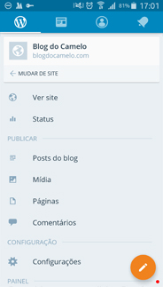

# Aplicativo WordPress

Adicione seu website no aplicativo

O Aplicativo Wordpress possibilita a edição de seus posts e páginas (ou a criação de novos) e até mesmo de imagens, tudo pelo seu celular.

O primeiro passo é baixar o aplicativo para seu celular.

Depois de baixar o aplicativo, abra-o, e uma janela de boas vindas aparecerá, clique em Adicionar site hospedado.

Em seguida adicione os detalhes de seu site.

### Edição de um post

Se você quiser editar um post, acesse o menu Posts do blog.

Ao clicar, uma tela com todos os Posts aparecerá, clique no Post desejado para editá-lo. 

A edição de Páginas é semelhante ao de Posts, clique no ícone de edição localizado na região inferior direita da tela.

### Criando novos posts

Para criar um novo post, clique no ícone que está na região inferior direita da tela, como mostra a figura abaixo. 

Na seguinte tela aparecerá todos os campos possíveis de edição de posts como vimos anteriormente.

