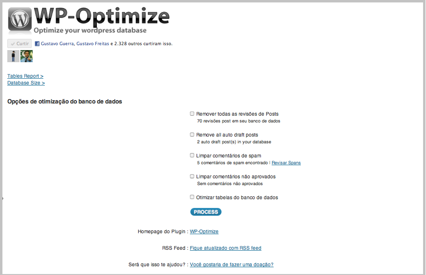
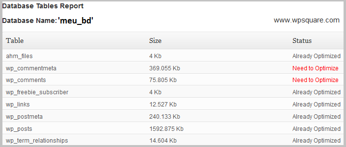
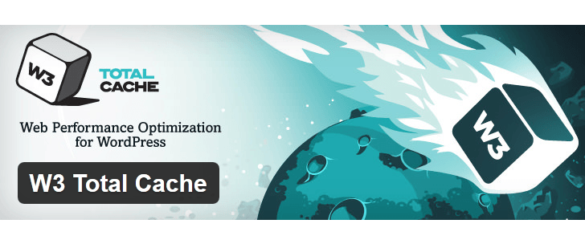

# Como otimizar o WordPress

### WP Optmize

Existem muitas formas para otimizar o seu site/blog em WordPress, otimizar um blog/site é importante pois faz com que o blog/site tenha um carregamento rápido, tanto para o SEO (Otimização de Sites), quanto para leitores que em muitos casos não possuem uma boa conexão de internet.

O plugin **WP - Optimize** é uma ótima ferramenta para fazer a otimização do seu site/blog em WordPress.

### Instalando

No painel de controle do seu site vá em **Plugins > Adicionar Novo > Pesquisar**, digite no campo de busca WP - Optimize  e clique em Pesquisar Plugins, ao encontrar clique em Instalar agora, após a instalação ser concluída ative o plugin clicando no botão “**Ativar Plugin**”.

### Opções disponíveis de configuração

**Remove all Post Revisions **(Remover todas as revisões de posts): Esta opção limpa todas as entradas de revisões de posts feitos de nosso Banco de Dados.

**Clean marked Spam comments** (Limpar comentários de spam): Deleta todos os comentários marcados como Spam.

**Clean Unapproved comments** (Limpar comentários não aprovados): Deleta todos os comentários não aprovados.Economiza tempo, basta aceitar os que são necessários e depois executar esta ação e deletar os pendentes.

**Optimize database tables** (Otimizar tabela de banco de dados): Esta opção otimiza seu Banco de Dados MySQL reorganizando-o.

Marque todas as opções que deseja para otimizar e clique no botão Proces. No final da otimização é apresentado uma tela que exibe a tabela do banco de dados do site/blog, o que estiver marcado em vermelho significa que pode ser otimizado.

Veja no final da tela a sua tabela no Banco de Dados. Tudo o que esta marcado em vermelho significa que pode ser otimizado.

### Configurando o wp-config.php

O wp-config.php é o arquivo de configuração do WordPress, nele podemos definir informações de conexão com o banco de dados entre outras coisas, nesse arquivo existem algumas diretivas que podemos alterar/acrescentar para que seu site/blog tenha um nível de otimização e personalização diferenciado.
Posts

Podemos definir o tempo em que um post permanece na lixeira antes de ser excluído. Como padrão o no wp-config é 30 dias, mas podemos aumentar ou diminuir o prazo de acordo com nossas necessidades modificando a constante EMPTY_TRANSH_DAYS.

define('EMPTY_TRASH_DAYS', 60); // define para 60 dias
A função de revisão de posts pode ser um problema pois aumenta o tamanho do banco de dados rapidamente
define('WP_POST_REVISIONS', false); // desabilita a funcionalidade
define('WP_POST_REVISIONS', 2); // define um máximo de 2 revisões por post

A função de auto save na página de criação de posts pode ser ajustada, é possível personalizar o intervalo de tempo entre os salvamentos automáticos, essa configuração é feita em segundos:
define('AUTOSAVE_INTERVAL', 220);

### Endereço do Blog e Endereço do Site

Por padrão essas duas inscrições não estão inclusas no wp-config.php, porém, adicionando ambas conseguimos melhorar bastante o desempenho do site/blog. Quando incluímos essas duas inscrições conseguimos uma redução no número de consultas ao banco de dados conseguindo assim, uma melhora no desempenho do site/blog. Essas configurações devem coincidir com as especificadas no painel do WordPress, abaixo um exemplo (não incluir a barra no final da URL)

define('WP_HOME', 'http://seusite.com');
define('WP_SITEURL', 'http://seusite.com');

É possível também definir esses valores dinamicamente usando a variável global do servi-dor:

define('WP_HOME', 'http://' . $_SERVER['HTTP_HOST'] . '/path/to/ wordpress');
define('WP_SITEURL', 'http://' . $_SERVER['HTTP_HOST'] . '/path/to/ wordpress');

### Template Path e Stylesheet Path

Também é possível estender o desempenho do site excluindo as consultas ao banco de dados para o "Template Path" e "Stylesheet Path" (caminho para o tema e o caminho para o estilo CSS), abaixo temos os valores padrão para as duas definições:

define('TEMPLATEPATH', get_template_directory());
define('STYLESHEETPATH',get_stylesheet_directory());

Mesmo assim ainda há consultas ao banco de dados, mas podemos eliminar essas queries e inserir o caminho absoluto:

define('TEMPLATEPATH', '/absolute/path/to/wp-content/themes/active-theme');
define('STYLESHEETPATH', '/absolute/path/to/wp-content/themes/ active-theme');

### Especificar Domínio de Cookie (Cookie Domain)

Especificando um domínio de cookie podemos por exemplo impedir que cookies sejam enviados com requisições de conteúdo estático em subdomínios. Neste exemplo, podemos utilizar esta constante para solicitar ao WordPress que envie cookies apenas para o seu domínio não estático. Isto pode dar um ganho significativo na performance, abaixo alguns exemplos de definição cookies domain:

define('COOKIE_DOMAIN', '.seudominio.com');
define('COOKIEPATH', preg_replace('|https?://[^/]+|i', '', get_op-tion('home').'/'));
define('SITECOOKIEPATH', preg_replace('|https?://[^/]+|i', '', get_option('siteurl').'/'));
define('PLUGINS_COOKIE_PATH', preg_replace('|https?://[^/]+|i','', WP_PLUGIN_URL));
define('ADMIN_COOKIE_PATH', SITECOOKIEPATH.'wp-admin');

### W3 TOTAL CACHE

O **plugin W3 Total Cache** é o plugin mais rápido e mais poderoso de cache que existe no mercado para WordPress. O W3 Total Cache melhora a experiência de navegação em seu site melhorando drasticamente a performance de seu servidor, guardando em cache to-dos os aspectos do seu site ou blog, e consequentemente reduzindo os tempos de carregamento de suas páginas.

### Pingdom Tools

O **Pingdom Tools** é uma ferramenta para diagnosticar DNS, essa ferramenta analisa as requisições HTTP que foram feitas pelo site, exemplo, imagens, scripts, folhas de estilo css e recursos externos como widgets sociais, vídeos, iframes e etc.

O melhor é que o Pingdom ainda gera um relatório de todos os arquivos do site
mostrando o momento em que o arquivo foi requisitado, quanto tempo levou para o servidor poder responder a requisição, o tempo de carregamento e finalizou a requisição. 

Assim, conseguimos identificar aberturas de desempenho que de outra forma não perceberíamos, como exemplo, arquivos pesados, servidor lento, scripts externos como Facebook, links quebrados e etc.

Outro Recurso importante do Pingdom é que ele exibe quanto tempo leva para o seu site ser carregado em diferentes lugares do mundo, isso é importante porque dependendo da distância de onde o seu site está hospedado ele pode carregar de forma mais lenta.
