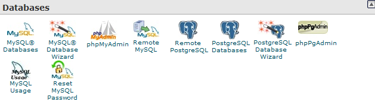
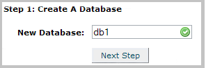
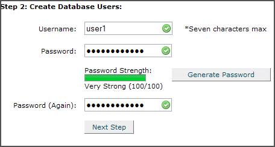
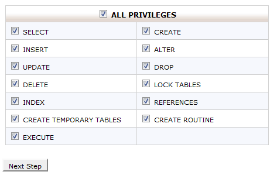
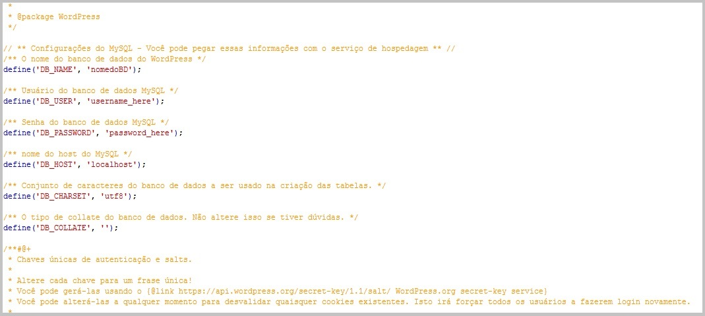
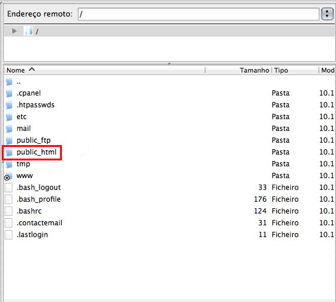
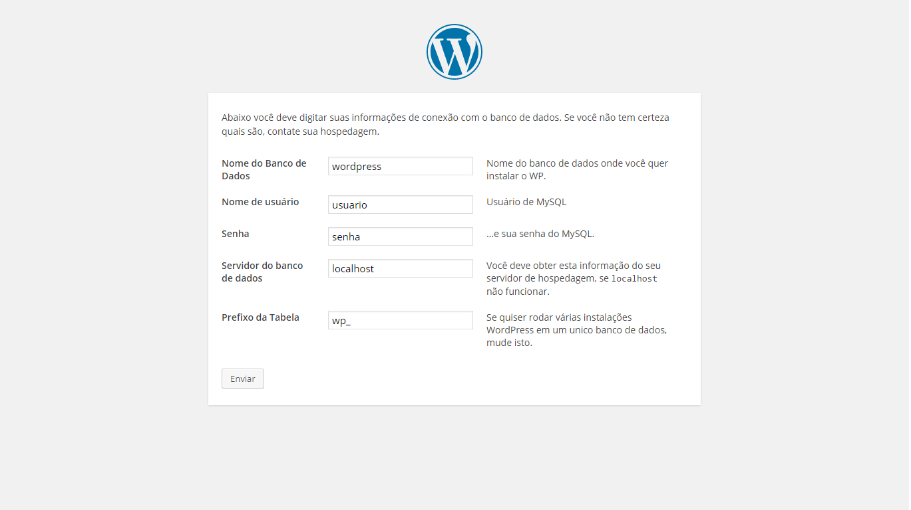
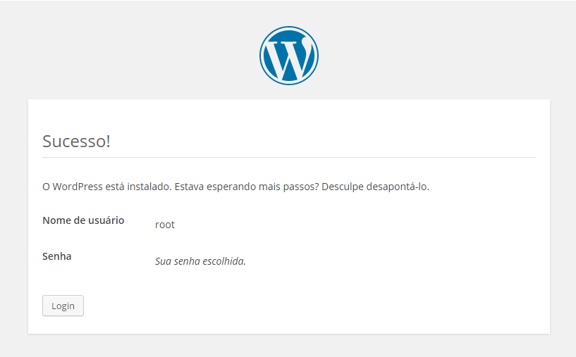

# Como Instalar

### Como Instalar

O primeiro passo para instalar o WordPress é baixar o pacote do WordPress no seu site oficial, é possível também baixar uma versão em Português do Brasil http://br.wordpress.org/.

Ao baixar o pacote na versão desejada você receberá um arquivo compactado com todos os ficheiros de instalação do WordPress. Descompacte esse arquivo e a partir dessa pasta compactada começamos a instalação do WordPress em seu servidor de hospedagem.

### Criando um Banco de Dados

O próximo passo para a instalação do WordPress é a criação do banco de dados. Vale lembrar que o WordPress utiliza MySQL como banco de dados e PHP, portanto, antes de prosseguir é necessário verificar se o seu plano de hospedagem fornece suporte à essas duas ferramentas.

Abra o Cpanel da sua conta de hospedagem, por "padrão" o endereço está disponível em www.seu-site.com/cpanel, entre com os dados de acesso cedidos pela empresa de hospedagem contratado.

Depois de acessar o Cpanel, clique no ícone **MySQL Wizard**.

Em **Step 1.** (Create a Database) digite o nome do banco de dados e clique em **Next Step**.

Em **Step 2.** (Create a Database Users) digite o nome do usuário do banco de dados e em seguida a sua senha, clique em **Create User**.

Em **Step 3**. Add User to Database devemos definir que tipos de privilégios o usuário do banco de dados irá ter,  clique em **All Privileges**.

Em **Step 4.** Complete the task Visualize e anote os valores de hostname, username, databasename e a senha que escolher.

###Configurando o banco de dados do WordPress

Abra o arquivo WP-config-sample.php com um editor de texto a sua escolha, será exibido o código fonte do arquivo, nesse momento é necessário fazer algumas modificações como mostra a figura abaixo:

Em "**nomedoBD**", digite o nome do seu banco de dados, em "**username_here**" digite o nome de usuário do seu banco de dados e por último em "**password_here**" digite a senha do seu banco de dados.
Depois de ter feito todas as alterações salve o arquivo com o nome "WP-config.php" na pasta "wordpress", após isso é necessário enviar essa pasta para o seu servidor.

### Carregando o WordPress ao servidor de hospedagem

Após fazer o download dos arquivos necessários para a instalação do WordPress é necessário fazer o upload da pasta descompactada para o FTP do seu site, para isso, é necessário ter um software cliente FTP previamente instalado no seu computador, recomendamos o uso do FileZilla.

Para que o WordPress fique na raiz do seu domínio como por exemplo, http://site.com/, os arquivos do WordPress precisam ficar na pasta principal do seu servidor, geralmente essa pasta chama-se "plubic_html".

Faça o upload dos arquivos do WordPress para a pasta plubic_html.

### Terminando a Instalação

Abra o navegador e digite o endereço do seu site/blog www.seusite.com, levando em consideração que os arquivos do WordPress foram colocados na pasta raiz do seu servidor.

Uma vez que foi editado corretamente o arquivo wp-config.php, aparecerá a tela a baixo:

Preencha todos os campos solicitados pela página, após preencher os dados clique em Instalar WordPress, abrirá a página como mostra a figura abaixo:

